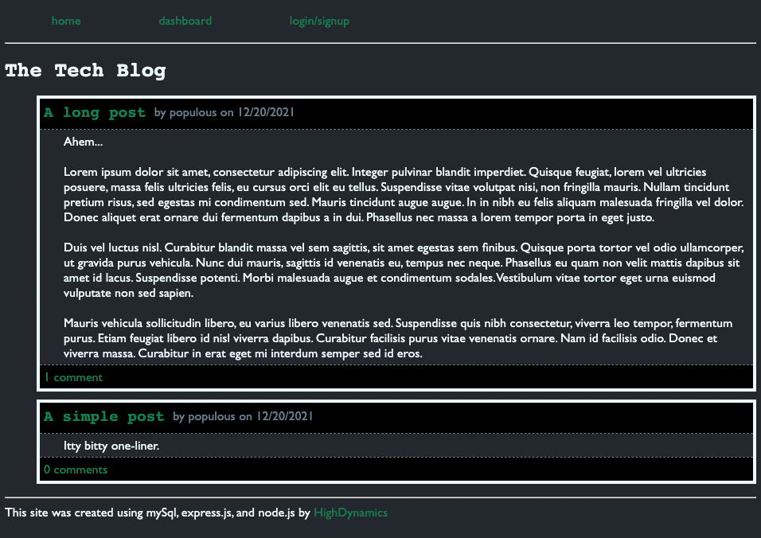

# Tech-Blog

## Description

A simple website where:

- Users can see posts and comments from other users
- Users can sign up to create posts and comments
- Users can edit their content

Deployed site: [tech-blog](https://murmuring-badlands-76079.herokuapp.com/)

## Table of Contents

1. [Questions](#Questions)

2. [License](#License)

## Questions

GitHub profile: [HighDynamics](https://github.com/HighDynamics)  
Reach out with additional questions at <highdynamics@gmail.com>

## License

Licensed under [MIT](https://opensource.org/licenses/MIT).
